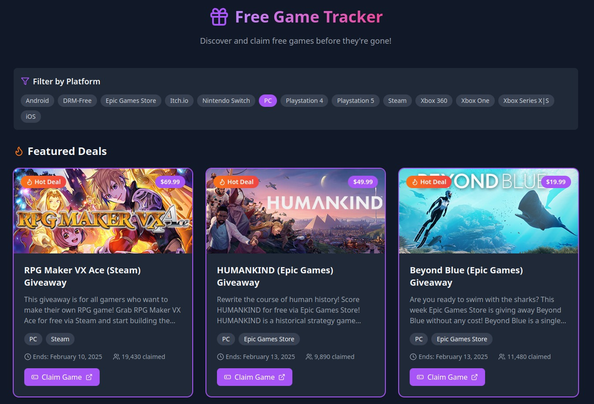

[![Contributors][contributors-shield]][contributors-url]
[![Forks][forks-shield]][forks-url]
[![Stargazers][stars-shield]][stars-url]
[![Issues][issues-shield]][issues-url]
[![MIT License][license-shield]][license-url]
[![LinkedIn][linkedin-shield]][linkedin-url]

<!-- PROJECT LOGO -->
<br />
<p align="center">
    

  <h2 align="center">Free Game Tracker</h2>

  <p align="center">
    Track free game giveaways from various platforms.
    <br />
    <a href="https://github.com/animikhaich/free-game-tracker/issues/new">Report Bug</a>
    ·
    <a href="https://github.com/animikhaich/free-game-tracker/issues/new">Request Feature</a>
  </p>

<p align="center">
  
</p>

<!-- TABLE OF CONTENTS -->

## Table of Contents

- [Table of Contents](#table-of-contents)
- [About The Project](#about-the-project)
- [Features](#features)
- [Getting Started](#getting-started)
  - [Prerequisites](#prerequisites)
  - [Built With](#built-with)
- [Setup and Usage](#setup-and-usage)
- [Contributing](#contributing)
- [License](#license)
- [Contact](#contact)
    - [Animikh Aich](#animikh-aich)

<!-- ABOUT THE PROJECT -->

## About The Project

This project is a web application that tracks free game giveaways from various platforms. It consists of a backend server built with Node.js and Express, and a frontend built with React and Vite.

**Disclaimer:** This code was written by code generation tools via prompting.

## Features

- Tracks free game giveaways from various platforms.
- Provides a user-friendly interface for browsing and filtering giveaways.
- [Add more features as you develop them]

## Getting Started

### Prerequisites

- [Docker](https://www.docker.com/) (optional, for containerized deployment)
- [Docker Compose](https://docs.docker.com/compose/install/) (optional, for containerized deployment)
- [Node.js](https://nodejs.org/)
- [npm](https://www.npmjs.com/) or [yarn](https://yarnpkg.com/)

### Built With

- [React](https://reactjs.org/)
- [Vite](https://vitejs.dev/)
- [Express](https://expressjs.com/)
- [Node.js](https://nodejs.org/)
- [Axios](https://axios-http.com/)
- [Lucide React](https://lucide.dev/)
- [Tailwind CSS](https://tailwindcss.com/)

## Setup and Usage

Clone the repository:

```sh
git clone https://github.com/animikhaich/free-game-tracker.git
```

**With Docker Compose:**

1. Install Docker Compose:  Refer to the [Docker Compose installation guide](https://docs.docker.com/compose/install/) for instructions specific to your operating system.
2. Run the application using Docker Compose:

```sh
cd free-game-tracker
docker-compose up --build
```


**Without Docker:**

1. Install dependencies:

```sh
cd free-game-tracker
cd backend
npm install
cd ../frontend
npm install
```

2. Configure the backend:

    *   Create a `.env` file in the `backend` directory with the necessary environment variables (if any).

3. Run the application:

```sh
cd free-game-tracker
cd backend
npm start
cd ../frontend
npm run dev
```

The frontend will be accessible at `http://localhost:[port]` (usually 3000 or 5173), and the backend will be accessible at `http://localhost:[port]` (usually 4000).


## Contributing

Contributions are what make the open source community such an amazing place to be learn, inspire, and create. Any contributions you make are **greatly appreciated**.

1. Fork the Project
2. Create your Feature Branch (`git checkout -b feature/AmazingFeature`)
3. Commit your Changes (`git commit -m 'Add some AmazingFeature'`)
4. Push to the Branch (`git push origin feature/AmazingFeature`)
5. Open a Pull Request

## License

Distributed under the MIT License. See `LICENSE` for more information.

## Contact

#### Animikh Aich

- Website: [Animikh Aich - Website](http://www.animikh.me/)
- X: [@AichAnimikh](https://x.com/AichAnimikh)
- LinkedIn: [animikh-aich](https://www.linkedin.com/in/animikh-aich/)
- Email: [animikhaich@gmail.com](mailto:animikhaich@gmail.com)

[contributors-shield]: https://img.shields.io/github/contributors/animikhaich/free-game-tracker.svg?style=flat-square
[contributors-url]: https://github.com/animikhaich/free-game-tracker/graphs/contributors
[forks-shield]: https://img.shields.io/github/forks/animikhaich/free-game-tracker.svg?style=flat-square
[forks-url]: https://github.com/animikhaich/free-game-tracker/network/members
[stars-shield]: https://img.shields.io/github/stars/animikhaich/free-game-tracker.svg?style=flat-square
[stars-url]: https://github.com/animikhaich/free-game-tracker/stargazers
[issues-shield]: https://img.shields.io/github/issues/animikhaich/free-game-tracker.svg?style=flat-square
[issues-url]: https://github.com/animikhaich/free-game-tracker/issues
[license-shield]: https://img.shields.io/github/license/animikhaich/free-game-tracker.svg?style=flat-square
[license-url]: https://github.com/animikhaich/free-game-tracker/blob/main/LICENSE
[linkedin-shield]: https://img.shields.io/badge/-LinkedIn-black.svg?style=flat-square&logo=linkedin&colorB=555
[linkedin-url]: https://linkedin.com/in/animikh-aich/
